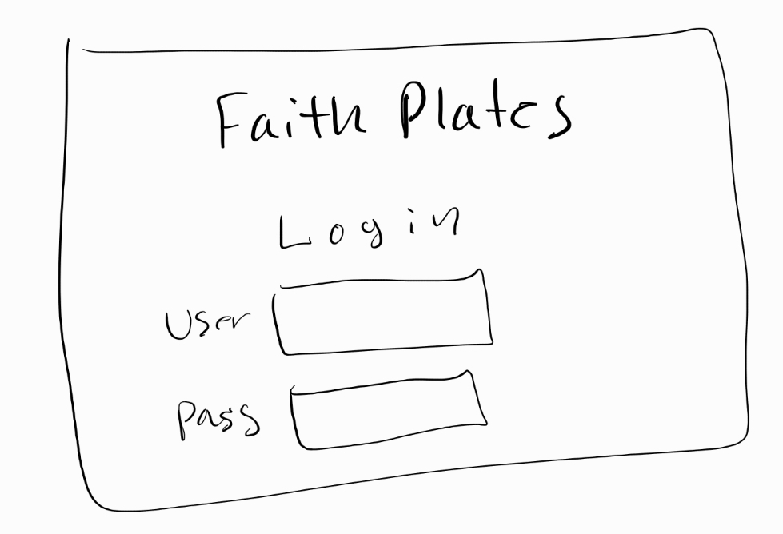
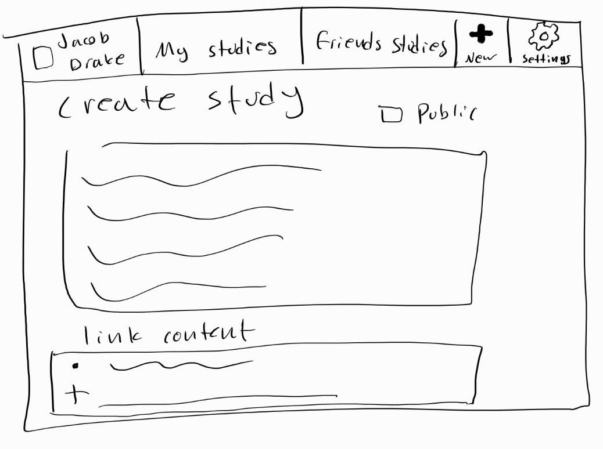
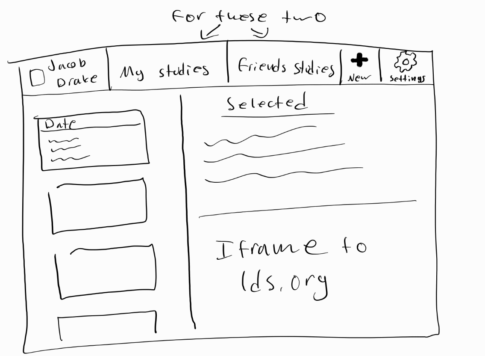

# startup

[Notes Link](Notes/notes.md)

# FaithPlates

## Description deliverable

### Elevator pitch

Do you want a good place to store your gospel study notes? Would you like a platform where you can create, see, and share your notes with friends and family? FaithPlates makes that possible. Your notes are stored in the cloud for easy access from any device. You can share your notes with friends and family. You can even see their notes and learn from them.

### Design

### Key features

- Secure login over HTTPS
- Create, edit, and delete studies
- View studies from other users
- Share studies with other users

### Technologies

I am going to use the required technologies in the following ways.

- **HTML** - Uses correct HTML structure for application. Four HTML pages: Login page, create study page, Personal Study page, Friend's study page. Links to pages in header. Iframes for displaying study links.
- **CSS** - Application styling that looks good on different screen sizes, uses good whitespace, color choice and contrast.
- **JavaScript** - Provides login, choice display, applying votes, display other users votes, backend endpoint calls.
- **Service** - Backend service with endpoints for:
  - login
  - retrieving studies
  - posting studies
- **DB** - Store users and studies.
- **Login** - Register and login users. Credentials securely stored in database.
- **WebSocket** - There will be a notification system for friend requests and study shares.
- **React** - Application ported to use the React web framework.

## HTML deliverable

For this deliverable I built out the structure of my application using HTML.

- **HTML pages** - Four HTML pages. The login page, home page, friend studies page, and compose page.
- **Links** - The login page automatically links to the home page. The rest of the pages have links to the others and a logout page to return to the login page.
- **Text** - Most of the text shown will be the content from the database but there are titles for all the sections.
- **Images** - I inserted an icon on every page.
- **Login** - Input box for username and password with a submit button for login.
- **Database** - The studies and users will be stored in a database. I put mocked data on the html pages.
- **WebSocket** - There is a notification section on the home page that will notify the user of friend requests and study shares in real time.
- **3rd Party services** - The users can provide links to websites containing their study material. These will be pulled up in iframes.
